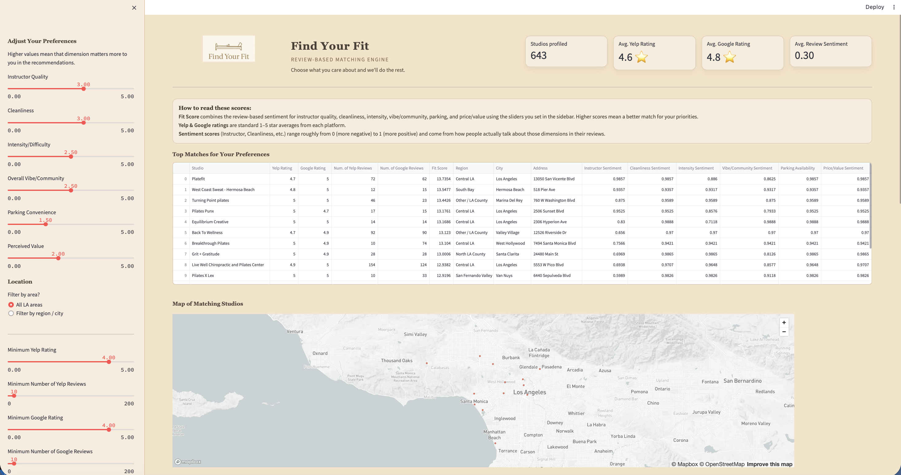
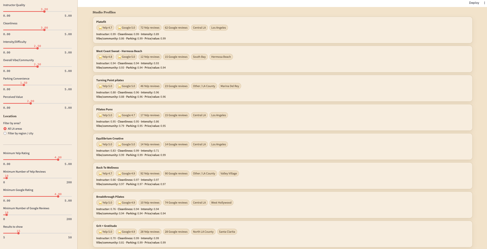

# Find Your Fit — Review-Driven Pilates Studio Recommendation Engine

---

## Project Overview
Find Your Fit is a review-based experience matching system designed to help users identify Pilates studios that best align with their personal preferences. Rather than relying on generic class types or objective difficulty labels, the system extracts **sentiment-derived experiential attributes** from review text—such as instructor quality, cleanliness, intensity, studio vibe, and perceived value—and combines them into a personalized **FitScore**.

The project prioritizes interpretability, transparency, and user-centered design over black-box prediction, allowing users to understand *why* a studio is recommended rather than receiving opaque recommendations.

---

## Dashboard Preview

---

## Motivation & Problem Statement
Fitness consumers often struggle to find studios that feel like a “good fit,” even when many options are available. Review platforms contain rich qualitative data, but this information is difficult to synthesize at scale. Traditional recommendation systems often rely on:
- coarse labels (e.g., beginner vs. advanced),
- star ratings alone,
- or complex machine learning models with limited interpretability.

This project addresses that gap by:
- extracting **experience-based attributes directly from review language**,
- aggregating sentiment at the studio level,
- and enabling users to explicitly weight what matters most to them.

---

## Data Sources

### Yelp Reviews (Primary Data Source)
Yelp review data was initially collected using the Yelp API to identify Pilates studios and retrieve review text. The retrieved data was processed and saved locally as structured CSV datasets to enable repeatable analysis without requiring repeated API calls.

Review text was then used to extract sentiment-derived experiential attributes such as instructor quality, cleanliness, intensity, studio vibe, and perceived value.
Yelp review text serves as the core data source for this project. Yelp data was used to:
- identify Pilates studios,
- analyze review text,
- extract sentiment scores for experiential attributes.

The Yelp Academic Dataset was used during development and exploration. Due to GitHub file size constraints, raw Yelp JSON files are not included in the repository. All processing logic that relies on this data is documented in the codebase. The Streamlit application reads from the processed dataset rather than making live API calls, ensuring fast performance and avoiding external API dependencies during runtime.

### Google Places API (One-Time Enrichment)
The Google Places API was used to enrich studio profiles with:
- `google_place_id`
- `google_rating`
- `google_user_ratings_total`

These values are stored in the final processed dataset and are **not fetched at runtime**. The Streamlit application reads the saved values to run.

---

## Technologies Used

- Python
- Streamlit
- Pandas
- NLP sentiment analysis (VADER / HuggingFace)
- Yelp API
- Google Places API
- Mapbox / geospatial visualization

---

## Data Processing Pipeline

1. **Studio Identification**  
   Pilates studios were identified using Yelp business metadata.

2. **Review Cleaning & Preparation**  
   Review text was cleaned and standardized for analysis.

3. **Sentiment & Attribute Extraction**  
   Reviews were analyzed to derive sentiment scores for experiential attributes, including:
   - Instructor quality  
   - Cleanliness  
   - Intensity  
   - Studio vibe  
   - Value / price perception  

4. **Studio-Level Aggregation**  
   Sentiment scores were aggregated across reviews to form a single profile per studio.

5. **Google Places Enrichment**  
   Studio profiles were enriched with Google rating and review count via the Google Places API and saved into the final dataset.

6. **Final Dataset Creation**  
   The resulting dataset is stored as:  
   `data/processed/pilates_studio_profiles_final.csv`

---

## FitScore Design
The **FitScore** is a weighted matching score that reflects the alignment between:
- user-selected preference weights, and
- studio-level sentiment attributes.

The FitScore was intentionally designed to be:
- interpretable,
- adjustable by the user,
- and transparent in how recommendations are generated.

This design choice prioritizes user trust and explainability over opaque predictive performance.

---

## Application Interface
The Streamlit dashboard allows users to:
- select preference weights via sliders,
- view studio FitScores,
- compare studios across locations,
- explore studio-level summaries.

The application reads from the processed dataset and does not perform live API calls.

---

## Design Decisions & Tradeoffs
- Sentiment-derived experiential attributes were chosen over predefined class labels to better capture subjective experience.
- Interpretability was prioritized over complex machine learning models.
- External API usage was limited to offline enrichment to avoid runtime dependencies.
- Raw datasets were excluded from the repository due to size and reproducibility constraints.

## Limitations & Future Work
- Review sentiment may reflect selection bias.
- Attribute extraction depends on explicit textual signals.
- Future extensions could include: temporal sentiment trends, personalization based on user history, hybrid recommender systems.
